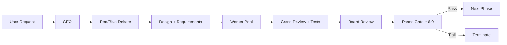

<div align="center">

# Dong AI Company

**您的私人AI公司 · Your Private AI Company**

[](https://python.org)
[](LICENSE)
[](.github/workflows/ci.yml)
[](tests/)
[](src/dong_ai/model_pool.py)
[](https://pypi.org/project/dong-ai/)

`pip install dong-ai`

</div>

---

**中文** | Dong AI 不是又一个 Agent 框架。它是一个**拥有完整治理结构的 AI 企业**——红蓝辩论决策、动态工人池执行、图记忆保持上下文连贯、董事会评分确保质量门。适用于软件开发、小说创作、游戏开发、数据分析、代码审计等任意项目类型。

**English** | Dong AI is not just another agent framework. It's an **AI company with full organizational governance** — red/blue team debate for decision making, dynamic worker pools for execution, graph memory for contextual coherence across large projects, and board review for quality gates. Works for software development, novel writing, game development, data analysis, code audit, and any project type.

---

## Core Capabilities · 核心能力

### 🏛️ AI Company Governance · 公司治理



Unlike traditional AI agents that operate as stateless chat interfaces, Dong AI implements a **full corporate decision-making pipeline**: each project undergoes structured debate, execution is distributed across dynamically assembled specialist workers, and every phase exits through a quality gate enforced by board-level scoring.

### 🧠 Graph Memory · 图记忆系统

Conventional LLM applications lose context beyond their window limit. Dong AI's **graph memory layer** persists structured knowledge across sessions:

- **Symbol indexing**: Every function, class, interface, and dependency is automatically extracted and stored in a queryable graph database
- **Contextual injection**: When starting a new task, the system queries the graph for relevant symbols, signatures, and dependency relationships — delivering precise context instead of raw text
- **Cross-phase coherence**: Phase 3 can reference symbols defined in Phase 1 with exact signatures, not vague descriptions
- **Requirement traceability**: Each task's output is linked back to specific design requirements, enabling coverage analysis and quality scoring

This architecture enables **coherent development across large, multi-phase projects** — the system doesn't remember by stuffing text into a context window; it remembers by maintaining a structured, queryable knowledge graph.

### 🔌 Ecosystem Integration · 生态集成

| Integration | Method |
|-------------|--------|
| **Hermes Skills** (125+) | Direct scan of `~/.hermes/skills/` |
| **MCP Protocol** | Discover and invoke any MCP server tool |
| **OpenAI API** | `dong serve` — any OpenAI client connects |
| **20+ Providers** | DeepSeek / OpenAI / Claude / Groq / Together / Local / Ollama |
| **Local Models** | Qwen / Llama / any GGUF — auto failover |
| **Webhook** | `POST /webhook` for external event triggers |

### ⚙️ Dual-Mode Architecture · 双模式架构

| Mode | CEO Context | Worker Context | Best For |
|------|-------------|----------------|----------|
| **API** | 256K | 128K | Cloud models (DeepSeek/GPT/Claude) |
| **Local** | 64K | 64K | Local deployment (Qwen/Llama/Ollama) |
| **Custom** | Any | Any | `dong config set ceo_context=999999` |

## Quick Start · 快速开始

```bash
# Installation
pip install dong-ai
pip install 'dong-ai[all]'     # full dependencies incl. API server

# Interactive setup wizard
dong setup

# Start chatting
dong chat

# One-click project execution
dong run "Build a configuration management system"

# Start API server → http://localhost:8648
dong serve
```

### Commands · 命令一览

```
dong chat          Interactive TUI          dong config      Configuration
dong run "req"     One-click project        dong skill       Skill management
dong serve         API server               dong session     Session history
dong setup         Setup wizard             dong mcp         MCP discovery
dong detect        Hardware detection       dong cron        Scheduled tasks
dong version       Version info             dong webhook     Webhook management
```

## Architecture · 架构

```
User Layer:       dong chat / dong run / dong serve / API clients

Orchestration:    CEO → DesignEngine(Red/Blue) → WorkerPool(Self-heal+Review)

Engine Layer:     ModelPool(20+ providers, auto failover) → LLMClient(unified HTTP/SSE)

Storage Layer:    Datastore(SQLite)
                  ├── MemoryRepository      Fact KV
                  ├── SessionRepository     Chat history
                  ├── ProjectRepository     Decisions & modules
                  ├── LoreRepository        World-building
                  └── GraphRepository       Code symbols, dependencies, requirements
```

## Project Pipeline · 项目管线

The CEO automatically identifies project type and generates a custom execution pipeline via LLM:

| Input | Detection | Pipeline |
|-------|-----------|----------|
| "Build a config system" | software | Scaffold → Core → Test → Release |
| "Write a cyberpunk novel" | novel | World-building → Characters → Chapters → Revision |
| "Develop a pixel RPG" | game | Design doc → Mechanics → Content → Build |
| "Analyze this architecture" | analysis | Data collection → Analysis → Report |
| "Audit this codebase" | audit | Scope → Review → Findings |

Each phase is executed by **dynamically recruited workers** (generated by LLM based on task requirements), followed by **cross-review**, **automated testing**, and **board scoring** with a minimum quality gate of 6.0/10.

## Testing · 测试

```bash
pip install pytest
pytest tests/
# 121 tests, all passing in ~1.6s
# Zero external dependencies — no network calls, no API keys needed
```

## License · 许可证

MIT — free for personal, research, and commercial use. Attribution required.

---

<div align="center">
  <sub>Not a chatbot — your AI workforce.</sub><br>
  <sub>Powered by Dong AI Company</sub>
</div>
